# TP13 — Stack Docker complète

## Partie 1 — API & Dockerfile

L'API expose trois routes : `GET /` (hostname, PET, compteur), `GET /healthz` (200 + `{status:ok}`), `GET /metrics` (prom-client). Le Dockerfile utilise `node:20-alpine`, `USER node`, `npm install --omit=dev`, et un HEALTHCHECK sur `/healthz`.

**Route `GET /`**

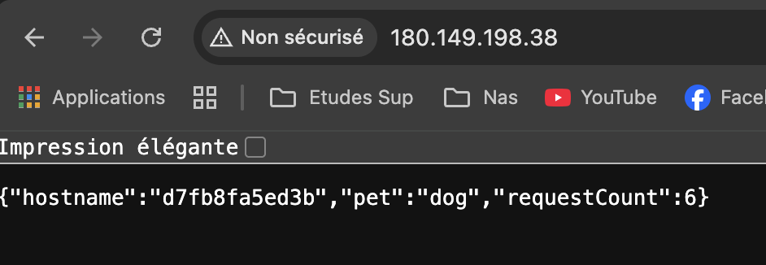

**Route `GET /healthz`**

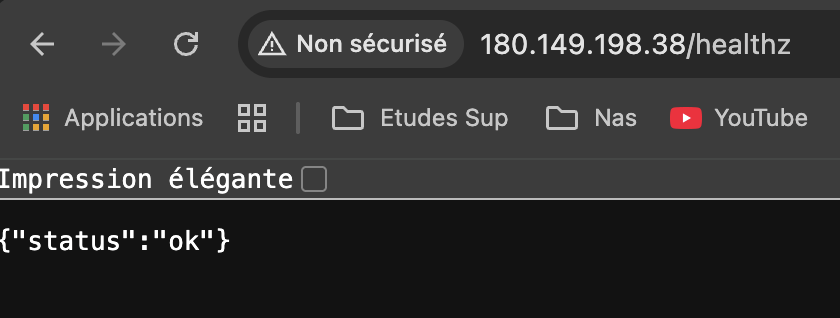

---

## Partie 2 — Registry privé

Registry privé défini dans `docker-compose.registry.yml` (`registry:2` + `joxit/docker-registry-ui`). L'image est taguée et poussée vers `localhost:5000/mon-api:1.0.0`, puis référencée dans le `docker-compose.yml` principal.

**Interface web du registry**

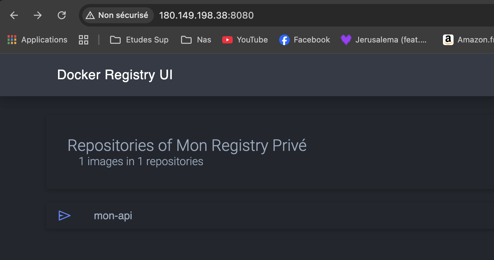

**Image `mon-api:1.0.0` listée dans le registry**

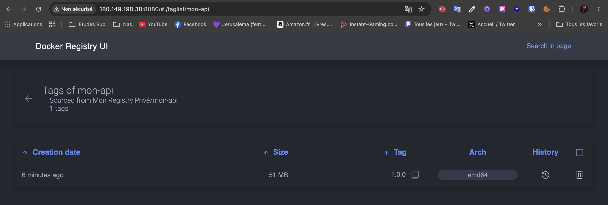

---

## Partie 3 — Stack Compose & Nginx

Trois services sur le réseau `api-net` : `cat` (PET=cat), `dog` (PET=dog), `nginx` (port 80). Les services `cat` et `dog` n'exposent aucun port à l'hôte. Nginx démarre uniquement quand `cat` et `dog` sont `healthy`.

| Route | Comportement |
|-------|-------------|
| `GET /` | Round-robin entre `cat` et `dog` |
| `GET /cat` | Exclusivement vers `cat` |
| `GET /dog` | Exclusivement vers `dog` |

---

## Partie 4 — Sécurité

Toutes les valeurs configurables (`PET`, ports, mot de passe Grafana) passent par `.env`, exclu du build via `.dockerignore` et du repo via `.gitignore`.

#### Justification `node:20-alpine`

Alpine embarque beaucoup moins de paquets système que Debian, ce qui réduit drastiquement la surface d'attaque :

| Image | Taille | CVE |
|-------|--------|-----|
| `node:20-alpine` | ~180 Mo | faible |
| `node:latest` | ~1,1 Go | élevé |

**Sortie Trivy sur `localhost:5000/mon-api:1.0.0`**

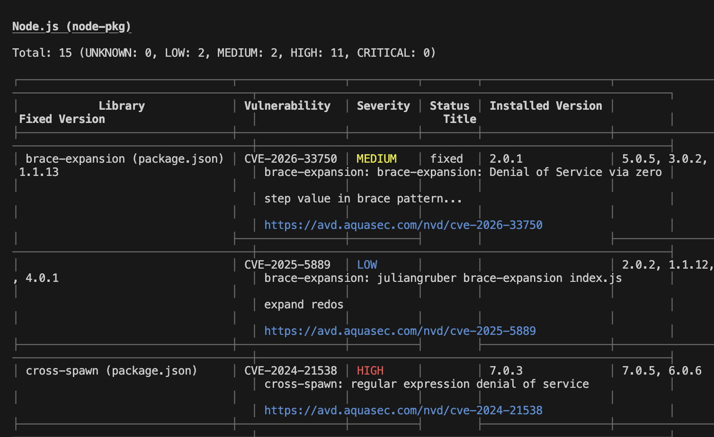

---

## Partie 5 — Validation de la stack

**`docker compose ps` — tous les services `Up (healthy)`**

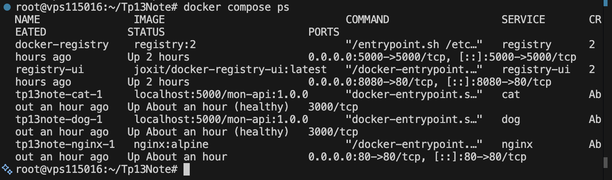

**Round-robin sur `GET /` — alternance des hostnames**

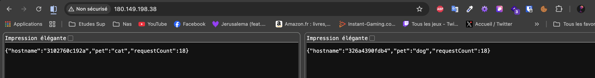

**`GET /dog` — PET=dog**

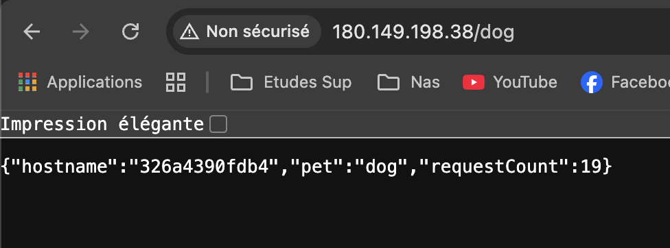

**`GET /cat` — PET=cat**

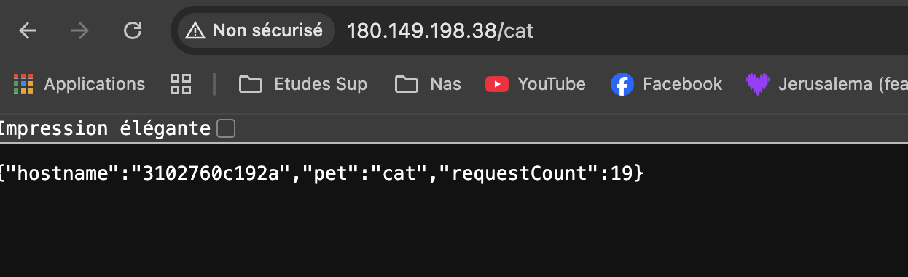

---

## Partie 6 — Questions théoriques

### `docker compose up` vs `docker stack deploy`

`docker compose up` lance les services sur **une seule machine** via le daemon Docker local. `docker stack deploy` déploie sur un **cluster Swarm** multi-nœuds et gère la haute disponibilité et la répartition des réplicas.

La directive `build:` est inutilisable en Swarm : les nœuds workers n'ont pas accès aux fichiers source. Les images doivent être **pré-buildées et disponibles dans un registry** accessible par tous les nœuds.

---

### Variable d'environnement vs Docker Secret

| | Variable d'environnement | Docker Secret |
|---|---|---|
| **Stockage** | En clair dans le processus | Chiffré (Raft/tmpfs) |
| **Visibilité** | `docker inspect`, `/proc/PID/environ` | Jamais exposée hors du conteneur |
| **Héritage** | Tous les processus fils | Uniquement le conteneur ciblé |

Le secret est monté en fichier dans `/run/secrets/<nom>`. Lecture en Node.js :
```js
const secret = require('fs').readFileSync('/run/secrets/mon_secret', 'utf8').trim();
```

---

### Que faut-il sauvegarder en production ?

**Recréable automatiquement** : images, conteneurs, réseaux, fichiers de config versionnés dans Git.

**Irremplaçable — à sauvegarder** :
- **Volumes Docker** (données BDD, fichiers uploadés)
- Fichier **`.env`** de production
- **Secrets** et certificats TLS/SSL
- Images du **registry privé** si non reconstruibles

---

## Partie 7 — Observabilité & Production

Stack de monitoring ajoutée au `docker-compose.yml` principal :

| Service | Image | Port |
|---------|-------|------|
| prometheus | `prom/prometheus:v2.53.0` | `9090` |
| grafana | `grafana/grafana:11.0.0` | `40110` |
| node-exporter | `prom/node-exporter:v1.8.1` | interne |
| cadvisor | `gcr.io/cadvisor/cadvisor:v0.49.1` | interne |
| portainer | `portainer/portainer-ce:2.20.3` | `40111` |

Le dashboard Grafana est **provisionné automatiquement** au démarrage (datasource + dashboard JSON versionnés dans `monitoring/grafana/provisioning/`). Les limites CPU/RAM sont dans `docker-compose.prod.yml` (override) :
```bash
docker compose -f docker-compose.yml -f docker-compose.prod.yml up -d
```

**Dashboard Grafana — provisionné automatiquement**

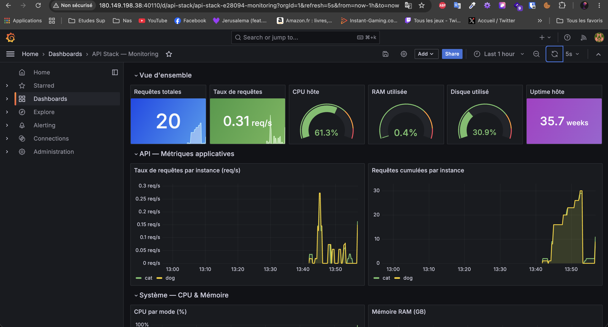

**Portainer — interface de gestion Docker**

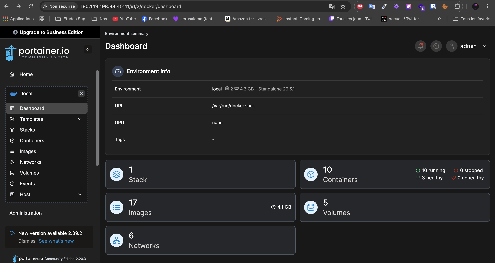

---

## Partie 8 — Volumes

**Volumes nommés** pour les données persistantes : `grafana-data`, `prometheus-data`, `portainer-data`, `registry_data`. Docker en gère le cycle de vie indépendamment des conteneurs.

**Bind mounts** pour les configs versionnées dans Git : `nginx.conf`, `prometheus.yml`, provisioning Grafana, `registry/config.yml`. Un changement de fichier sur l'hôte suffit à reconfigurer le service sans rebuild.

**`docker volume ls` — volumes nommés de la stack**

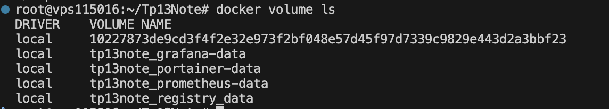

**`docker volume inspect tp13note_grafana-data`**

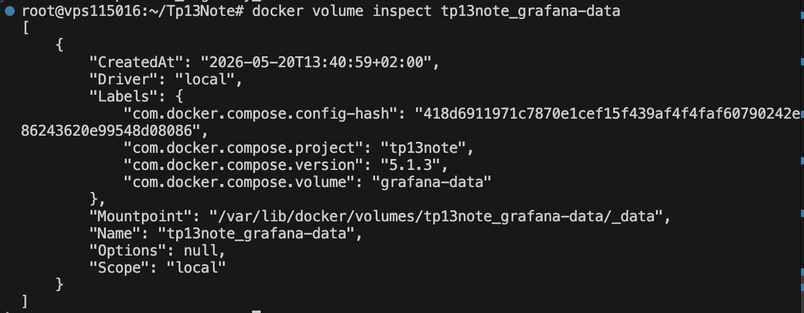

---

## Partie 9 — CI/CD avec GitHub Actions

Pipeline sur push `main` : **build** → **scan Trivy** (échec si CVE CRITICAL) → **push vers GHCR** avec tag `git-<sha>`. GHCR est utilisé car le `GITHUB_TOKEN` est fourni automatiquement, sans secret supplémentaire à configurer.

**Pipeline GitHub Actions — build, scan Trivy, push GHCR**

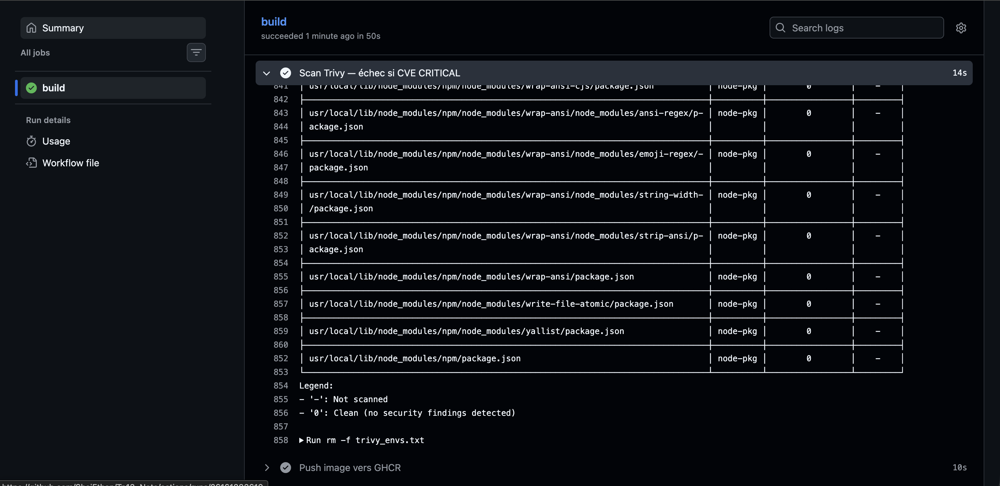

---

## Partie 10 — Déploiement sur VPS

Stack complète déployée sur VPS à l'adresse **http://180.149.198.38**

| Service | URL |
|---------|-----|
| API | http://180.149.198.38/ |
| /cat | http://180.149.198.38/cat |
| /dog | http://180.149.198.38/dog |
| Prometheus | http://180.149.198.38:9090 |
| Grafana | http://180.149.198.38:40110 |
| Portainer | http://180.149.198.38:40111 |
| Registry UI | http://180.149.198.38:8080 |

**`docker compose ps` sur le VPS — stack complète**

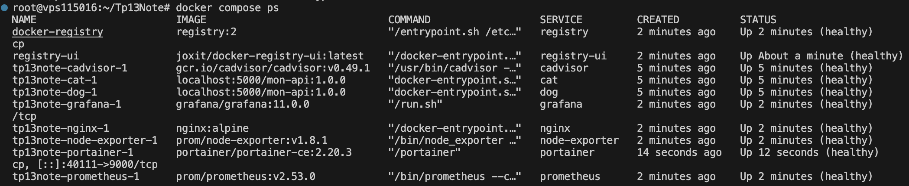
